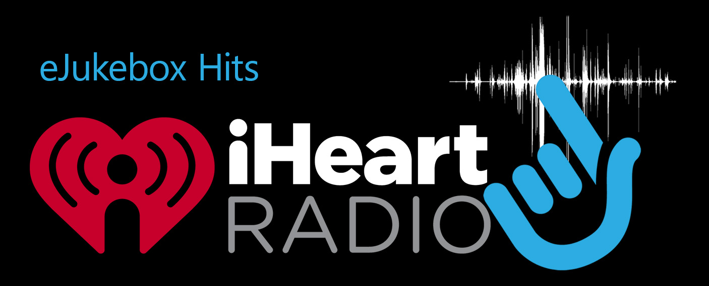
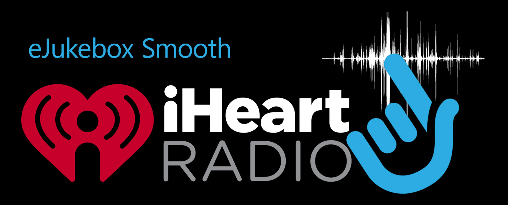

# Intro to HD Radio (high quality streams)

Prepare yourself for a captivating revelation that will leave you awe-struck. Nestled within the digital realm lies a trove of extraordinary, High Quality, High Definition (HD) **listen live** radio stream URLs, concealed from the mainstream and rarely acknowledged. These hidden gems remain elusive, not due to malice, but rather as a result of certain radio stations' budget constraints and technical limitations.

You see, these stations, driven by a desire to minimize expenses, often compress their audio into modest streams, unknowingly compromising the quality in their pursuit of efficiency. They underestimate the discerning abilities of the modern listener, assuming that the subtle differences between **48Kbps HE-AAC** and **128Kbps MP3** will go unnoticed. 

However, with the advent of exceptional audio devices, the gap in quality becomes palpable. It is a testament to our evolved senses and refined appreciation for audio fidelity. And now, my friend, I am delighted to unveil a curated compilation of radio listen live **streams** that will reignite your passion for the medium in all its resplendent glory. These **streams** are not typically used within the standard online radio platforms such as [iHeart radio](https://www.iheart.com/) or [Listnr](https://www.listnr.com/).

Within this sanctuary, you will experience **radio** as it was originally intended—transcendent, immersive, and of remarkable quality. These **streams**, surpassing even the esteemed FM analog standard of 96Kbps, are a testament to the progress of technology and the artistry of sound.

Prepare to be enraptured by the sheer brilliance of this auditory journey. Embrace this opportunity to rediscover the magic of radio, unadulterated by limitations, and revel in its true splendor. Let these extraordinary streams transport you to a world where audio excellence reigns supreme.

Best consumed with a pair of high quality headphones or speakers, these **streams** will leave you spellbound.

# eJukebox

I am proud to present [eJukebox](https://ejukebox.com.au) as the esteemed sponsor of this website. Renowned as a pioneer in the realm of remarkable sounding radio streams, [eJukebox](https://ejukebox.com.au) has undeniably set the gold standard for exceptional online radio experiences. Prepare to be astounded, for their unparalleled sound quality is truly unrivaled.

Within their illustrious repertoire, two extraordinary eJukebox streams reign supreme, both boasting a sublime 128Kbps MP3 audio format. In comparison to other radio stations, these streams effortlessly surpass the competition, offering an auditory feast that is simply unparalleled.

## eJukebox Hits

| Direct | iHeart Radio |
|:-------------|:---------------|
|  |  |

<!--Simplest syntax-->
<audio src="https://listen.ejukebox.net/one" type="audio/mpeg" controls>
  I'm sorry. You're browser doesn't support HTML5 <code>audio</code>.
</audio>

## eJukebox Smooth

| Direct | iHeart Radio |
|:-------------|:---------------|
|  |  |

<!--Simplest syntax-->
<audio src="https://listen.ejukebox.net/two" type="audio/mpeg" controls>
  I'm sorry. You're browser doesn't support HTML5 <code>audio</code>.
</audio>

## [KIIS 1065](https://www.kiis1065.com.au) - Sydney

Just like the many other radio stations listed on this site, you can listen live to **Kiis 1065 Sydney** in high quality. We're using Kiis 1065 as an example because it's one of the most popular radio stations in Australia.

The Number one hit radio station in Sydney, here's the high quality [KIIS 1065](https://www.kiis1065.com.au) **listen live** stream and alternative lower bitrate stream where you can easily tell the difference side by side:

| 128Kbps MP3 | 48Kbps AAC+ v2 |
|:-------------|:---------------|
| <audio src="https://playerservices.streamtheworld.com/api/livestream-redirect/ARN_KIIS1065_SC" type="audio/mpeg" controls>  I'm sorry. You're browser doesn't support HTML5 <code>audio</code>.</audio> |  |

As Kiis 1065 is part of the [Australian Radio Network](https://arn.com.au), you can listen to the rest of ARN radio stations [here](arn).

I recently contacted Kiis for comment, this was there response:

It's bullshit, as eJukebox is listed on iHeart radio with two stations and are streaming at 128Kbps.

<!-- 

<media-controller audio>
  <hls-video
    src="https://playerservices.streamtheworld.com/api/livestream-redirect/ARN_KIIS1065AAC"
    slot="media"
    crossorigin
  ></hls-video>
  <media-control-bar>
    <media-play-button></media-play-button>
    <media-live-button></media-live-button>
    <media-mute-button></media-mute-button>
    <media-volume-range></media-volume-range>
    <media-cast-button></media-cast-button>
    <media-airplay-button></media-airplay-button>
  </media-control-bar>
</media-controller> -->

# Take streams with you

Below is the complete list of all the stations included on this website at a glance. You can take the streams with you (copy/paste) and listen to these on another device or in another app. As example, the **Sonos** system supports adding custom streams, or other mobile phone app such as the **Broadcasts** app on [iOS](https://apps.apple.com/au/app/broadcasts/id1469995354). With the **Broadcasts** app, you can manually add custom streams as well, and then the **Broadcasts** app also works across the phone itself or Apple Watch.

| Station | Location | Format | Stream URL |
|:-------------|:------------------|:------|:------|
| Kiis 1065 | Sydney | CHR | [128Kbps](https://playerservices.streamtheworld.com/api/livestream-redirect/ARN_KIIS1065_SC) |
| 2Day FM | Sydney | CHR | [128Kbps](https://wz2liw.scahw.com.au/live/2day_128.stream/playlist.m3u8) |
| Nova 969 | Sydney | CHR | [128Kbps](https://playerservices.streamtheworld.com/api/livestream-redirect/NOVA_969_AAC128_SC) |
| Nova 969 | Sydney | CHR | [320Kbps](https://playerservices.streamtheworld.com/api/livestream-redirect/NOVA_969_AAC320_SC) |
| **Dance Hits** | Sydney | Dance | [128Kbps](https://wz2liw.scahw.com.au/live/2dance_128.stream/playlist.m3u8) |
| Triple M | Sydney | Rock | [128Kbps](https://wz3liw.scahw.com.au/live/2mmm_128.stream/playlist.m3u8) |
| Triple M Classic Rock | Sydney | Classic Rock | [128Kbps](https://wz2liw.scahw.com.au/live/2classicrock_128.stream/playlist.m3u8) |
| **Triple M Country** | Sydney | Country | [128Kbps](https://wz2liw.scahw.com.au/live/2classicrock_128.stream/playlist.m3u8) |
| **Triple M Tradie Radio** | Sydney | Modern Rock | [128Kbps](https://wz2liw.scahw.com.au/live/290s_128.stream/playlist.m3u8) |
| WSFM | Sydney | AC | [128Kbps](https://playerservices.streamtheworld.com/api/livestream-redirect/ARN_WSFM_SC) |
| Smooth 95.3 | Sydney | AC | [128Kbps](https://playerservices.streamtheworld.com/api/livestream-redirect/SMOOTH953_AAC128_SC) |
| Smooth 95.3 | Sydney | AC | [320Kbps](https://playerservices.streamtheworld.com/api/livestream-redirect/SMOOTH953_AAC320_SC) |
| **Easy 80s Hits** | Sydney | AC | [128Kbps](https://wz2liw.scahw.com.au/live/2easy_128.stream/playlist.m3u8) |
| Smooth 80s | Sydney | AC | [128Kbps](https://playerservices.streamtheworld.com/api/livestream-redirect/SMOOTH_80S_AAC128_SC) |
| Smooth 80s | Sydney | AC | [320Kbps](https://playerservices.streamtheworld.com/api/livestream-redirect/SMOOTH_80S_AAC320_SC) |
| Smooth Vintage | Sydney | AC | [128Kbps](https://playerservices.streamtheworld.com/api/livestream-redirect/SMOOTHVINTAGE_SYD_AAC128_SC) |
| Smooth Vintage | Sydney | AC | [320Kbps](https://playerservices.streamtheworld.com/api/livestream-redirect/SMOOTHVINTAGE_SYD_AAC320_SC) |
| Smooth Relax | Sydney | Easy Listening | [128Kbps](https://playerservices.streamtheworld.com/api/livestream-redirect/SMOOTHRELAX_SYD_AAC128_SC) |
| Smooth Relax | Sydney | Easy Listening | [320Kbps](https://playerservices.streamtheworld.com/api/livestream-redirect/SMOOTHRELAX_SYD_AAC320_SC) |
| Triple J | NSW/VIC/TAS/ACT | Alternative | [128Kbps](https://mediaserviceslive.akamaized.net/hls/live/2038308/triplejnsw/masterhq.m3u8) |
| Double J | NSW/VIC/TAS/ACT | Alternative | [128Kbps](https://mediaserviceslive.akamaized.net/hls/live/2038315/doublejnsw/masterhq.m3u8) |
| ABC Classic 1 | NSW/VIC/TAS/ACT | Classical | [128Kbps](https://mediaserviceslive.akamaized.net/hls/live/2038316/classicfmnsw/masterhq.m3u8) |
| ABC Classic 2 | NSW/VIC/TAS/ACT | Classical | [128Kbps](https://mediaserviceslive.akamaized.net/hls/live/2038317/classic2/masterhq.m3u8) |
| Kiis 1011 | Melbourne | CHR | [128Kbps](https://playerservices.streamtheworld.com/api/livestream-redirect/ARN_KIIS1011_SC) |
| Fox FM | Melbourne | CHR | [128Kbps](https://wz3liw.scahw.com.au/live/3fox_128.stream/playlist.m3u8) |
| Nova 100 | Melbourne | CHR | [128Kbps](https://playerservices.streamtheworld.com/api/livestream-redirect/NOVA_100_AAC128_SC) |
| Nova 100 | Melbourne | CHR | [320Kbps](https://playerservices.streamtheworld.com/api/livestream-redirect/NOVA_100_AAC320_SC) |
| Triple M | Melbourne | Rock | [128Kbps](https://wz3liw.scahw.com.au/live/3mmm_128.stream/playlist.m3u8) |
| Triple M Classic Rock | Melbourne | Classic Rock | [128Kbps](https://wz2liw.scahw.com.au/live/3classicrock_128.stream/playlist.m3u8) |
| Gold 1043 | Melbourne | AC | [128Kbps](https://playerservices.streamtheworld.com/api/livestream-redirect/ARN_GOLD1043_SC) |
| Smooth 91.5 | Melbourne | AC | [128Kbps](https://playerservices.streamtheworld.com/api/livestream-redirect/SMOOTH915_AAC128_SC) |
| Smooth 91.5 | Melbourne | AC | [320Kbps](https://playerservices.streamtheworld.com/api/livestream-redirect/SMOOTH915_AAC320_SC) |
| Kiis 973 | Brisbane | CHR | [128Kbps](https://playerservices.streamtheworld.com/api/livestream-redirect/ARN_973FM_SC) |
| B105 | Brisbane | CHR | [128Kbps](https://wz4liw.scahw.com.au/live/4bbb_128.stream/playlist.m3u8) |
| Nova 1069 | Brisbane | CHR | [128Kbps](https://playerservices.streamtheworld.com/api/livestream-redirect/NOVA_1069_AAC128_SC) |
| Nova 1069 | Brisbane | CHR | [320Kbps](https://playerservices.streamtheworld.com/api/livestream-redirect/NOVA_1069_AAC320_SC) |
| Triple M | Brisbane | Rock | [128Kbps](https://wz4liw.scahw.com.au/live/4mmm_128.stream/playlist.m3u8) |
| Triple M Classic Rock | Brisbane | Classic Rock | [128Kbps](https://wz2liw.scahw.com.au/live/4classicrock_128.stream/playlist.m3u8) |
| Triple J | QLD | Alternative | [128Kbps](https://mediaserviceslive.akamaized.net/hls/live/2038347/triplejqld/masterhq.m3u8) |
| ABC Classic 1 | QLD | Classical | [128Kbps](https://mediaserviceslive.akamaized.net/hls/live/2038352/classicfmqld/masterhq.m3u8) |
| 96FM | Perth | CHR | [128Kbps](https://playerservices.streamtheworld.com/api/livestream-redirect/ARN_96FM_SC) |
| Mix 94.5 | Brisbane | CHR | [128Kbps](https://wz6liw.scahw.com.au/live/6mix_128.stream/playlist.m3u8) |
| Nova 937 | Perth | CHR | [128Kbps](https://playerservices.streamtheworld.com/api/livestream-redirect/NOVA_937_AAC128_SC) |
| Nova 937 | Perth | CHR | [320Kbps](https://playerservices.streamtheworld.com/api/livestream-redirect/NOVA_937_AAC320_SC) |
| Triple M | Perth | Rock | [128Kbps](https://wz6liw.scahw.com.au/live/6ppm_128.stream/playlist.m3u8) |
| Triple M Classic Rock | Perth | Classic Rock | [128Kbps](https://wz2liw.scahw.com.au/live/6classicrock_128.stream/playlist.m3u8) |
| Triple J | WA | Alternative | [128Kbps](https://mediaserviceslive.akamaized.net/hls/live/2038345/triplejwa/masterhq.m3u8) |
| ABC Classic 1 | WA | Classical | [128Kbps](https://mediaserviceslive.akamaized.net/hls/live/2038349/classicfmwa/masterhq.m3u8) |
| Mix 1023 | Adelaide | CHR | [128Kbps](https://playerservices.streamtheworld.com/api/livestream-redirect/ARN_MIX1023_SC) |
| SAFM | Adelaide | CHR | [128Kbps](https://wz5liw.scahw.com.au/live/5ssa_128.stream/playlist.m3u8) |
| Nova 919 | Adelaide | CHR | [128Kbps](https://playerservices.streamtheworld.com/api/livestream-redirect/NOVA_919_AAC128_SC) |
| Nova 919 | Adelaide | CHR | [320Kbps](https://playerservices.streamtheworld.com/api/livestream-redirect/NOVA_919_AAC320_SC) |
| Triple M | Adelaide | Rock | [128Kbps](https://wz5liw.scahw.com.au/live/5mmm_128.stream/playlist.m3u8) |
| Cruise 1323 | Adelaide | AC | [128Kbps](https://playerservices.streamtheworld.com/api/livestream-redirect/ARN_CRUISE1323_SC) |
| Triple J | SA | Alternative | [128Kbps](https://mediaserviceslive.akamaized.net/hls/live/2038346/triplejsa/masterhq.m3u8) |
| ABC Classic 1 | SA | Classical | [128Kbps](https://mediaserviceslive.akamaized.net/hls/live/2038351/classicfmsa/masterhq.m3u8) |
| Triple M Classic Rock | Adelaide | Classic Rock | [128Kbps](https://wz2liw.scahw.com.au/live/5classicrock_128.stream/playlist.m3u8) |
| Triple J | NT | AC | [128Kbps](https://mediaserviceslive.akamaized.net/hls/live/2038348/triplejnt/masterhq.m3u8) |
| ABC Classic 1 | NT | AC | [128Kbps](https://mediaserviceslive.akamaized.net/hls/live/2038323/classicfmnt/masterhq.m3u8) |